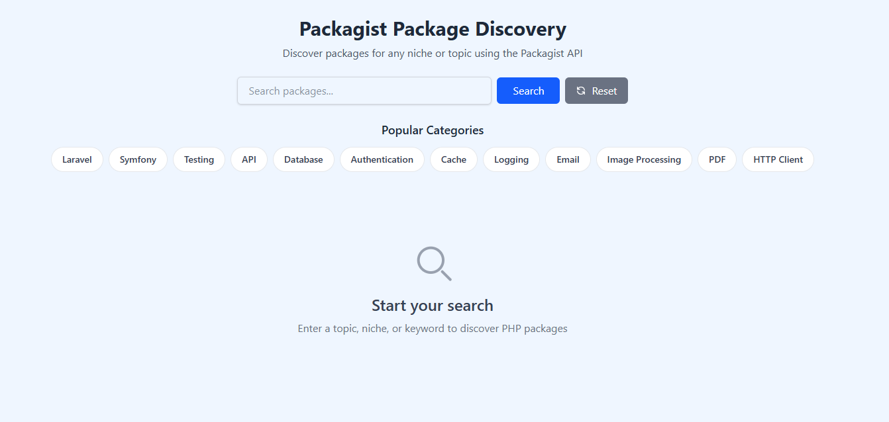
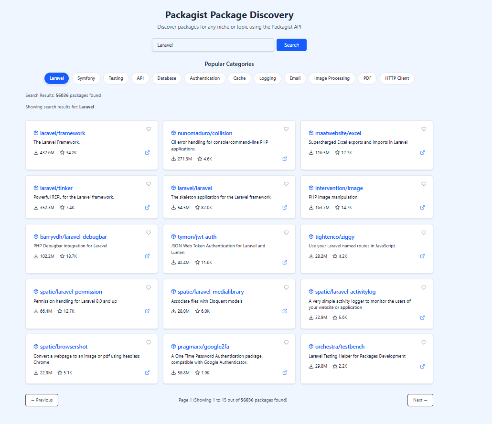
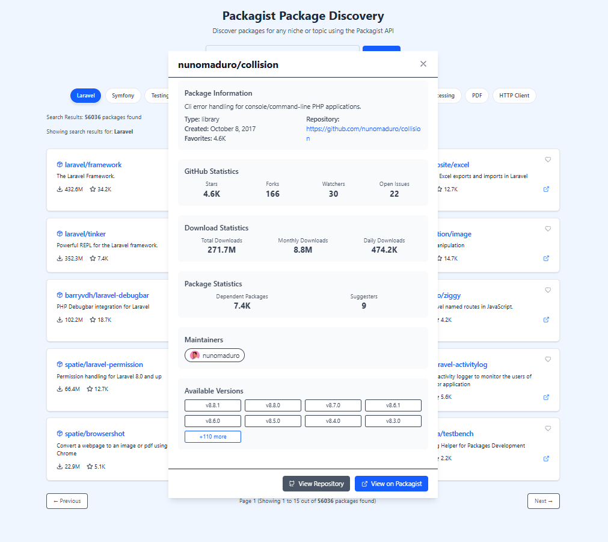
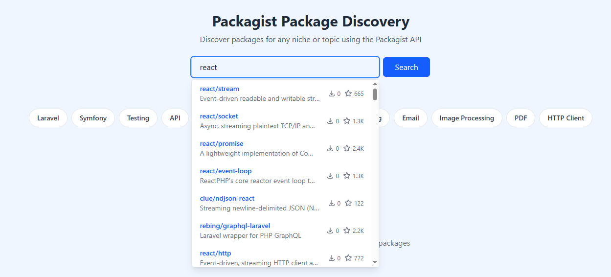

# Packagist Package Discovery

<p align="center">
<a href="https://packagist.org"></a>
<a href="https://laravel.com"></a>
<a href="https://tailwindcss.com"></a>
</p>

## 📸 Screenshots

> **Note**: Screenshots are stored in the `/docs/screenshots` directory. You can view them by:
> 1. Cloning the repository
> 2. Opening the `/docs/screenshots` directory
> 3. Viewing the following files:
>    - `main-interface.png` - Main interface with search and package grid
>    - `package-details.png` - Detailed package information and statistics
>    - `search-results.png` - Advanced search results with filtering options
>    - `live-search.png` - Searching live as you type

<div align="center">
  
  <p><em>Main interface with search and package grid</em></p>
</div>

<div align="center">
  
  <p><em>Advanced search results with filtering options</em></p>
</div>

<div align="center">
  
  <p><em>Detailed package information and statistics</em></p>
</div>

<div align="center">
  
  <p><em>Advance live search system</em></p>
</div>

## 🚀 Quick Start

```bash
# Clone the repository
git clone https://github.com/yourusername/PackageDiscovery.git
cd PackageDiscovery

# Install dependencies
composer install
npm install

# Setup environment
cp .env.example .env
php artisan key:generate

# Build assets
npm run build

# Start the server
php artisan serve
```

Visit `http://localhost:8000` to see the application locally.

## ✨ Features

### 🔍 Search & Discovery
- **Smart Search**: Find packages by name, description, or tags
- **Autocomplete**: Real-time package suggestions as you type
- **Popular Packages**: Browse trending and most-downloaded packages
- **Tag Filtering**: Filter packages by categories and tags

### 📊 Package Analytics
- **Download Statistics**: Total, monthly, and daily download counts
- **GitHub Metrics**: Stars, forks, watchers, and open issues
- **Dependency Graph**: View package dependencies and requirements
- **Version History**: Browse through package versions and changelog

### 👥 Community Features
- **Maintainer Profiles**: View package maintainers and their contributions
- **Package Ratings**: See package popularity and favorites
- **Dependency Analysis**: Track package dependencies and suggesters

## 🛠️ Technical Stack

- **Backend**: Laravel 10.x
- **Frontend**: TailwindCSS 3.x
- **JavaScript**: Alpine.js
- **API**: Packagist API Integration
- **Caching**: Laravel Cache System

## 📚 API Integration

The application integrates with Packagist's API endpoints:

| Endpoint | Description |
|----------|-------------|
| `search.json` | Package search and discovery |
| `explore/popular.json` | Popular packages listing |
| `packages/{vendor}/{package}.json` | Detailed package information |
| `p2/{vendor}/{package}.json` | Package versions and metadata |

## 🤝 Contributing

We welcome contributions! Please see our [Contributing Guidelines](CONTRIBUTING.md) for details.

1. Fork the repository
2. Create your feature branch (`git checkout -b feature/amazing-feature`)
3. Commit your changes (`git commit -m 'Add amazing feature'`)
4. Push to the branch (`git push origin feature/amazing-feature`)
5. Open a Pull Request

## 🔒 Security

If you discover any security-related issues, please email [your-email@example.com](mailto:your-email@example.com) instead of using the issue tracker.

## 📄 License

This project is licensed under the MIT License - see the [LICENSE](LICENSE) file for details.

## 🙏 Acknowledgments

- [Laravel](https://laravel.com) - The web framework used
- [TailwindCSS](https://tailwindcss.com) - The CSS framework
- [Packagist](https://packagist.org) - The package repository
- [Alpine.js](https://alpinejs.dev) - The JavaScript framework
